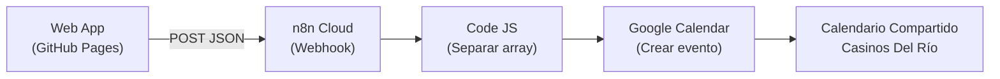
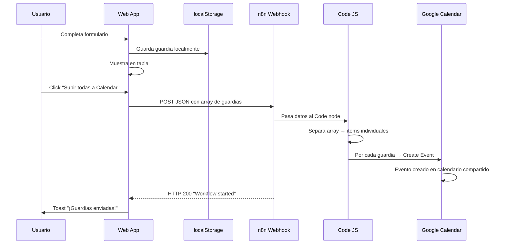

# Cronograma de Guardias — Documentación de Producción

## 📐 Arquitectura del Sistema



---

## 🌐 URLs y Accesos

| Recurso | URL |
|---------|-----|
| **Web App (Pública)** | [https://yazminloliger.github.io/cronograma-guardias/](https://yazminloliger.github.io/cronograma-guardias/) |
| **Repositorio GitHub** | [https://github.com/YazminLoliger/cronograma-guardias](https://github.com/YazminLoliger/cronograma-guardias) |
| **n8n Cloud** | [https://empredimientos-crown.app.n8n.cloud/](https://empredimientos-crown.app.n8n.cloud/) |
| **Workflow n8n** | `Guardias Calendar Sync` (ID: `iMDKBDn1J2lpevDR`) |
| **Webhook (Producción)** | `https://empredimientos-crown.app.n8n.cloud/webhook/18c4cc38-18a8-4413-a2ce-aefdaccba134` |
| **Google Calendar destino** | ID: `c_c04f8b1416043231f3f3b0e9a2f80ab9f03b7748b927619079fc91b45859e068@group.calendar.google.com` |

---

## 🗂️ Componentes

### 1. Web App (Frontend — GitHub Pages)

Archivos estáticos alojados en GitHub Pages con despliegue automático vía GitHub Actions.

| Archivo | Rol |
|---------|-----|
| [index.html](file:///home/yloliger/Documentos/guardias/index.html) | Estructura HTML, formulario y tabla |
| [styles.css](file:///home/yloliger/Documentos/guardias/styles.css) | Diseño dark-mode con glassmorphism |
| [app.js](file:///home/yloliger/Documentos/guardias/app.js) | Lógica: registro, persistencia, envío a n8n |
| [.github/workflows/static.yml](file:///home/yloliger/Documentos/guardias/.github/workflows/static.yml) | Auto-deploy a GitHub Pages en cada push |

**Funcionalidades principales:**
- Formulario de registro individual (nombre, fechas, horas en formato 24h con máscara automática)
- Tabla de cronograma con estados (Activa / Próxima / Finalizada)
- Stats en tiempo real (total, agentes, activas hoy, próximas)
- Persistencia local con `localStorage`
- Botón **📅 individual** por fila para abrir Google Calendar con datos pre-cargados
- Botón **"📅 Subir todas a Calendar"** que envía POST JSON al webhook de n8n

---

### 2. n8n Cloud (Backend — Webhook + Google Calendar)

Workflow **"Guardias Calendar Sync"** con 3 nodos encadenados:

#### Nodo 1: Webhook
- **Método:** POST
- **URL Producción:** `https://empredimientos-crown.app.n8n.cloud/webhook/18c4cc38-18a8-4413-a2ce-aefdaccba134`
- **Autenticación:** None (público)
- **Función:** Recibe el array JSON de guardias desde la web app

#### Nodo 2: Code in JavaScript
- **Función:** Toma el array JSON recibido y lo separa en items individuales, armando `startDateTime` y `endDateTime` en formato ISO para Google Calendar.

```javascript
const items = $input.all();
const body = items[0].json.body || items[0].json;
const guards = Array.isArray(body) ? body : [body];

return guards.map(guard => ({
    json: {
        agentName: guard.agentName,
        startDate: guard.startDate,
        startTime: guard.startTime,
        endDate: guard.endDate,
        endTime: guard.endTime,
        startDateTime: guard.startDate + 'T' + guard.startTime + ':00',
        endDateTime: guard.endDate + 'T' + guard.endTime + ':00'
    }
}));
```

#### Nodo 3: Google Calendar — Create an event
- **Credencial OAuth2:** `yloliger@casinosdelrio.com.ar`
- **Calendar ID:** `c_c04f8b1416043231f3f3b0e9a2f80ab9f03b7748b927619079fc91b45859e068@group.calendar.google.com`
- **Start:** `{{ $json.startDateTime }}`
- **End:** `{{ $json.endDateTime }}`
- **Summary (Título):** `{{ $json.agentName }}`

---

## 🔄 Flujo de Datos



---

## 📋 Formato de Datos (JSON)

Cada guardia enviada al webhook tiene esta estructura:

```json
{
  "id": "1710851234567",
  "agentName": "Juan Pérez",
  "startDate": "2026-03-19",
  "startTime": "09:00",
  "endDate": "2026-03-26",
  "endTime": "09:00"
}
```

El botón "Subir todas" envía un **array** de estos objetos.

---

## 🚀 Cómo Usar

1. Abrí [la web](https://yazminloliger.github.io/cronograma-guardias/).
2. Completá el **Nombre del Agente**.
3. Seleccioná **Fecha de Inicio** y **Fecha de Fin**.
4. Tipeá la hora en formato 24h (ej: `0900` → se convierte en `09:00`).
5. Clic en **"Registrar Guardia"** — se agrega a la tabla.
6. Repetí para todos los agentes que necesites.
7. Clic en **"📅 Subir todas a Calendar"** — el botón se pone en "⏳ Subiendo..." y al terminar confirma cuántas se subieron.

---

## ⚠️ Consideraciones Importantes

- **Persistencia local:** Los datos se guardan en `localStorage` del navegador. Si se borra la caché del navegador, se pierden los registros de la tabla (pero los que ya se subieron a Calendar permanecen).
- **Duplicados:** Actualmente el sistema **no verifica duplicados**. Si se presiona "Subir todas" dos veces seguidas, se crearán eventos repetidos en el calendario. Para evitarlo, borrar las guardias de la tabla después de subirlas, o verificar manualmente en Calendar.
- **Credencial Google:** La credencial OAuth2 en n8n tiene vencimiento. Si deja de funcionar, entrar a n8n → abrir el workflow → nodo Google Calendar → reconectar la credencial.
- **n8n API Key:** Se creó una API key (`Jetski API Key`) para administración del workflow. Vence el 16/01/2026.

---

## 🛠️ Mantenimiento

| Tarea | Dónde |
|-------|-------|
| Modificar diseño/formulario | Editar archivos en `/home/yloliger/Documentos/guardias/`, hacer `git push` |
| Cambiar calendario destino | n8n → Workflow "Guardias Calendar Sync" → nodo "Create an event" → campo Calendar ID |
| Renovar credencial Google | n8n → Settings → Credentials → Google Calendar OAuth2 API |
| Ver logs de ejecución | n8n → Workflow → pestaña "Executions" |
| Cambiar webhook URL | Actualizar la constante `n8nWebhookUrl` en `app.js` y hacer `git push` |
